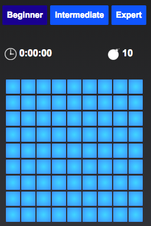
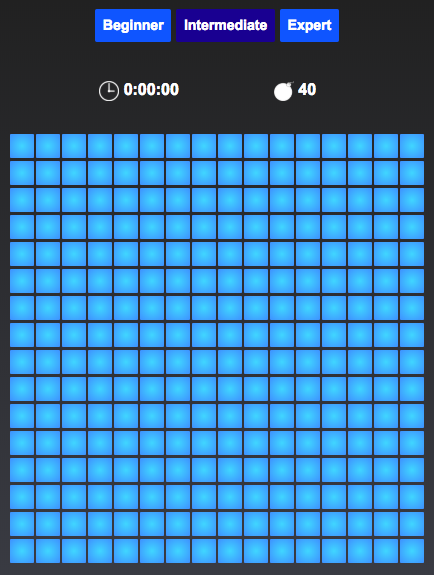
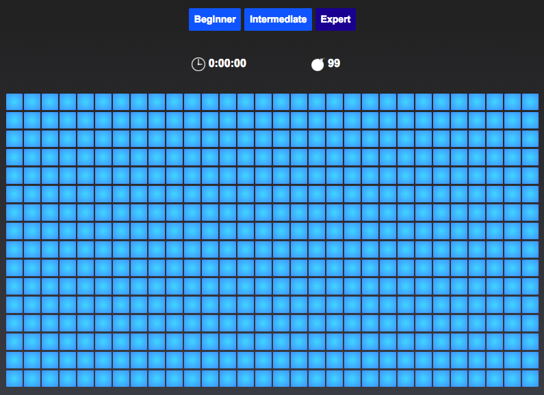
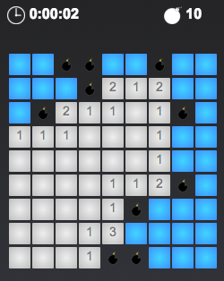
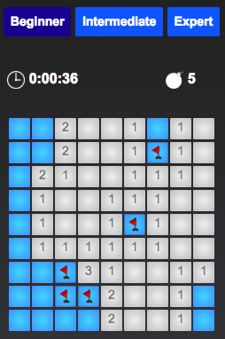
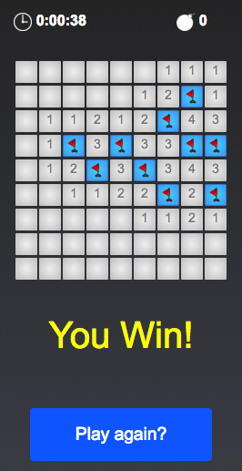

# Minesweeper

Minesweeper is a single-player puzzle game. The objective of the game is to clear a rectangular board containing hidden *"mines"* or bombs without detonating any of them, with help from clues about the number of neighboring mines in each field. The game originates from the 1960s, and has been written for many computing platforms in use today. It has many variations and offshoots.

## How to Play
You can play this game online [here](https://alijy.github.io/Minesweeper/). 

You can play Minesweeper in three different modes. These modes represent different difficulty levels of the game. The modes are:

- __Beginner Mode__: A simple 9 X 9 grid containing 10 hidden mines which cover about **12%** of the grid.



- __Intermediate Mode__: A more challenging 16 X 16 grid containing 40 hidden mines which covers about **16%** of the grid.



- __Expert Mode__: The most challenging mode which is a grid of size 16 X 30 with 99 mines that makes about **20%** of the grid.



Each cell of the grid is of one of the 3 different types:

- *Mine cell:* This cell contains a mine and if revealed, you lose the game.
- *Empty cell:* This is an empty cell with no adjacent mine. If revealed, it also reveals all it's adjacent cells all of which are safe *(i.e. non-mine cell)*
- *Numbered cell:* This is also an empty cell but with some adjacent mines. If revealed, it shows a number which represents the number of adjacent cells that contain a mine.



The game starts by default on the *Beginner* mode. There are 3 ways to interact with the board:

**1. Click:** If you click on a cell which hasn't been explored (revealed) before, it reveals the content of that cell which is one of the 3 types mentioned above.

**2. Right-Click:** If you right-click on an unexplored cell with no flag, it adds a flag on that cell to mark the location of a mine. If you right-click on a flagged cell, the flag is removed.

**3. Double-Click:** If you double-click on a revealed and numbered cell, if the cell's number matches the number of flags surrounding it, any other unexplored and unflagged adjacent cells are revealed. These could be empty cells, numbered cells or even mine cells which will end the game if revealed.



**Your task** is to clear the board without detonating any of the mines.




Have fun!


## How to Download and Run the Game on your Local Machine
To download the game go to the top of this page and click on . Then click on **Download ZIP** and save the zip file to your local machine. After unzipping the file go to **Minesweeper** folder and open the *index.html* file in you browser. 

Usually double-clicking the file name opens the file in your default web browser. If that doesn't work, copy the location of the *index.html* file and paste it into your browser's address bar and press enter. You should be good to go! ENJOY!


## Implementation Considerations

### Break down of goal to a few smaller tasks:

1. Define the rules
2. Structure the game
3. Draw the board
	1. Draw cells
	2. Plant mines
	3. Calculate the adjacent mines
7. Find a way to traverse the board
8. Implement the "reveal" logics


### Define the rules:

1. The goal of the game is to find all mines on the board.

2. You reveal mines by clicking the board cells.

3. If you reveal a cell with a mine you lose the game.
4. If you reveal a cell without a mine it will show exact number of mines surrounding that cell.
5. If you reveal a cell without a number it means that there are no mines in its surroundings. In that case board will reveal all connected empty fields with its surroundings.
6. You can flag a cell by right-clicking it.
7. If you double-click on a revealed cell and you already flagged all mines around that cell, the board will reveal the rest of the hidden (unflagged) cells. Of course, if you misplaced flags you will reveal a cell with a mine and lose the game.

### Challenges:

1. Javascript doesn't have a right-click event!!

	**Solution:** Use the ```.mouseup()``` event and ```event.which```.
	
	```
	$('.cell').mouseup(function(event) {
	      var mouseButton = event.which;
	      var row = parseInt($(event.target).attr("cellRow"));
	      var col = parseInt($(event.target).attr("cellCol"));
	
	      if (mouseButton == 1) {
	        leftClick(board, row, col);
	      } else if (event.which == 3) {
	        rightClick(board, row, col);
	      }
	
	      if ($('#timer').text() == "0:00:00") {
	        timerStarter();
	      }
	    })
	
	```


2. I used a *.gif* file on all mine locations to animate the explosion of mines. But, uploading and playing several versions of the same file several times without refreshing the page is not feasible.

	**Solution:** Create a unique url for every *.gif* image that needs to be displayed by following the link with ```?random=```followed by a random number from a very large pool of random numbers. This way each url is unique while pointing to the same image.
	
	```
	var imgUrl = "url('images/mine1.gif?random=" + Math.floor(Math.random() * 10000000 + 1000000) + "')";
	
	$(mineCell).addClass('mine').css("background-image", imgUrl);
	
	```

## Future Development
**- Adding an expolsion propagation feature:** If you hit a mine it explodes and the explosion gradually propagates to detonate other mines which are further away.


<!--## TODO
- ~~fix the *Play Again?* button~~
- ~~fix the flagged cells issue~~
- ~~implement the mine count down~~
- ~~implement the timer~~
- ~~implement **rule 7** above~~
- ~~add explosion animation~~
- replace numbers with pictures
- ~~add audio~~
- ~~add media query~~
-->

